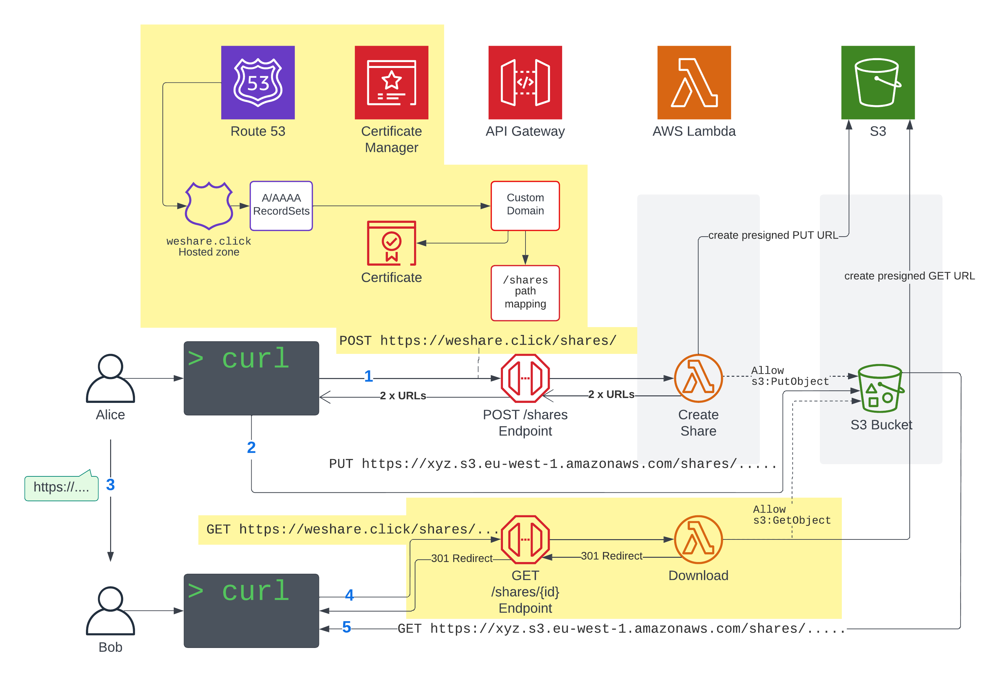

# weshare.click

A file-sharing application, but from scratch on AWS by [Luciano](https://twitter.com/loige) and [Eoin](https://twitter.com/eoins) live on [AWS Bites](https://awsbites.com)

## What are we building?
A file sharing application. Imagine that you have a file you want to share with others, or even with yourself on another device. You don't want to use Google Drive, Dropbox, or any of the public cloud services, perhaps because they are blocked in some way.
This codebase will allow you to deploy your own, branded file sharing service!

## Iterations

We will start with a working MVP and go from there. The scope and order of iterations is _subject to change!_

1. **MVP:** The simplest possible file sharing between a sender (who owns all the AWS infrastructure) and the receiver
2. **Domain Names and Fancy URLs**
3. **Command Line Interface (CLI)**
4. **Deployment Pipeline**
5. **Authorisation**
6. **Expiration, quotas, limits, pricing**
7. 💡 **Your ideas!** [Let us know!](https://github.com/awsbites/weshare.click/issues)

## MVP Architecture

